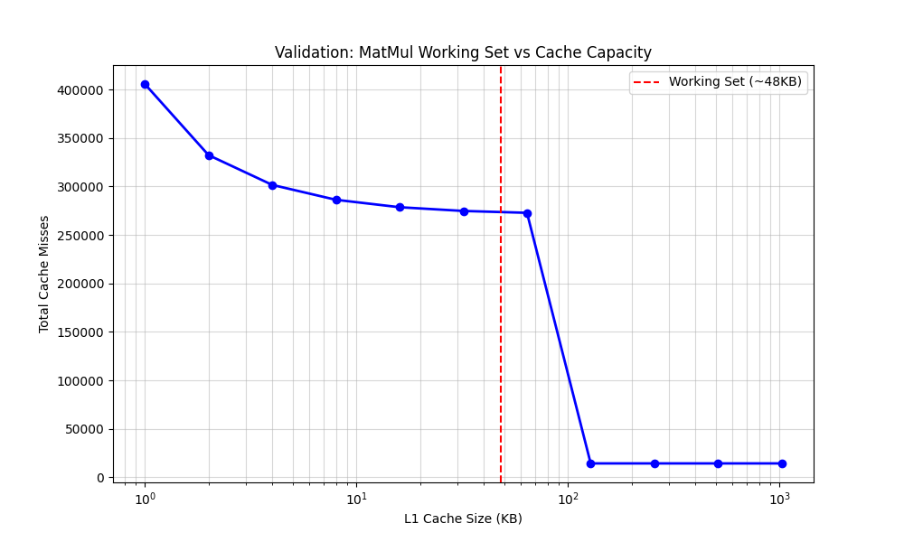

# CPU Microarchitecture Simulator & AI Workload Profiler

A pre-silicon, behavioral CPU performance simulator designed to analyze the interaction between **software algorithms** (specifically AI-style kernels) and **hardware microarchitecture** (Cache, Pipeline, Branch Prediction).

**Status:** Active

**Language:** C++17

**Focus:** Computer Architecture · Systems Performance · Pre-Silicon Validation

---

## 📖 Project Overview

This project is not an instruction set emulator (like QEMU) or a cycle-accurate RTL model.
Instead, it is a **behavioral simulator** that models the performance characteristics of a modern CPU.

The goal is to answer architectural trade-off questions, such as:

* *How does L1 cache size impact the execution time of a matrix multiplication kernel?*
* *What is the performance cost of branch misprediction in a deep pipeline?*
* *How do memory access patterns in convolution layers drive cache eviction?*

This tool simulates the **hardware cost of software**, focusing on latency, stalls, and memory hierarchy effects rather than register-level correctness.

### 🎯 Intended Audience

This project is aimed at:

* Systems / Platform Engineers
* Pre-Silicon Software & Architecture Engineers
* Performance Analysis & Tooling Engineers

---

## ⚙ Execution Model (Explicit Assumptions)

The simulator models a simplified CPU with the following assumptions:

* **In-order execution**
* **Single-issue pipeline**
* **Blocking L1 cache**
* **Full pipeline flush on branch misprediction**

The simulator is designed to study **performance trends and sensitivities**, not to produce cycle-accurate results.

---

## ⚡ Key Features

### 1. Pipeline Modeling

* Models a simplified **5-stage in-order pipeline**
* Captures pipeline stalls caused by:
* **Structural hazards** (busy pipeline stages)
* **Control hazards** (branch mispredictions)


* Pipeline depth and issue width are configurable

### 2. Cache Hierarchy Modeling

* **Set-associative L1 cache**
* Configurable size, line size, and associativity
* Implements:
* **Bitwise address decoding** (tag / index / offset)
* **Deterministic eviction** (simplified replacement)


* Enables sensitivity analysis to visualize:
* Temporal locality
* Spatial locality
* Capacity-driven cache thrashing (“cache cliff” behavior)


### 3. Branch Prediction

* Implements a **probabilistic branch predictor**
* Models prediction accuracy (e.g., 95%)
* Measures:
* Misprediction frequency
* Pipeline flush penalties


* Uses a fixed RNG seed for deterministic replay

### 4. AI-Representative Workloads

The simulator includes synthetic workloads that represent common AI memory behaviors:

* **GEMM / Matrix Multiplication**
* O(N³) access pattern
* Stresses cache capacity and conflict behavior
* Highlights row-major vs column-major locality issues


* **Conv1D (1D Convolution)**
* Sliding window access pattern
* High temporal reuse of kernel weights
* Models inference-style streaming behavior


These workloads generate instruction streams that stress the simulated architecture without executing real arithmetic.

---

## 🏗 Code Architecture

The codebase enforces a strict separation between **architecture models** (hardware) and **workload drivers** (software), mirroring real pre-silicon development workflows.

```text
cpu-sim/
├── include/
│   ├── arch/        # Hardware contracts (Pipeline, Cache, Branch Predictor)
│   ├── sim/         # Simulator interface
│   └── workload/    # Workload interfaces
├── src/
│   ├── arch/        # Microarchitecture implementations
│   ├── sim/         # Main simulation loop
│   └── workload/    # AI-style workload generators
├── tools/
│   └── validate_sensitivity.py  # Cache-size sweep & visualization
└── README.md

```

---

## 🚀 Quick Start

### Build

```bash
g++ -std=c++17 -O2 \
  -I./include \
  src/main.cpp \
  src/arch/*.cpp \
  src/sim/*.cpp \
  src/workload/*.cpp \
  -o cpu-sim

```

### Run a Simulation

Run the simulator by passing the **L1 cache size (in bytes)** as a command-line argument.

```bash
# Run Matrix Multiplication with a 32KB L1 cache
./cpu-sim 32768

```

### Sample Output

```text
=== Simulation Results ===
L1 Size:      32768
Instructions: 265400
Cycles:       1105200
IPC:          0.24
Cache Misses: 274816

```

---

## 🧪 Validation Strategy

Validation is performed in two complementary layers:

### 1. Unit Verification (Contract Testing)

A dedicated test runner validates architectural invariants, such as:

* Re-accessing the same address produces a cache hit
* Direct-mapped caches exhibit conflict misses
* Branch misprediction penalties are honored

This ensures logical correctness of individual components.

### 2. Behavioral Validation (Sensitivity Analysis)

The simulator is validated by sweeping L1 cache sizes and observing miss-rate trends for a fixed workload.

For a **64×64 Matrix Multiplication** (~49KB working set):

* Severe thrashing occurs when cache < working set
* Miss rate drops sharply once cache capacity exceeds the working set
* The resulting **“cache cliff”** confirms correct architectural behavior

Validation is automated using:

```bash
python3 tools/validate_sensitivity.py

```

The output is a plot of cache misses vs cache size, demonstrating expected physical behavior:

*Validation focuses on qualitative correctness (trends and cliffs) rather than absolute cycle accuracy.*

---

## 🧠 Design Rationale: Why This Matters

### The AI–Architecture Gap

Modern AI workloads are often **memory-bound**, not compute-bound.
This simulator demonstrates why large tensor operations can overwhelm general-purpose CPU caches, motivating specialized hardware such as NPUs and AI accelerators.

### Pre-Silicon Mindset

In real hardware development:

* Chips are expensive and slow to fabricate
* Architectural decisions must be validated *before* silicon exists

This project mirrors the **pre-silicon workflow**, where software models are used to evaluate trade-offs such as cache sizing, pipeline depth, and branch behavior long before hardware is built.

---

## 🔮 Future Improvements

* [ ] Add multi-level cache hierarchy (L2 / L3)
* [ ] Support superscalar execution (issue width > 1)
* [ ] Implement out-of-order execution (scoreboarding / Tomasulo)
* [ ] Add CPI breakdown reporting

---

## 📌 Summary

This project demonstrates:

* Systems-level C++ design
* Hardware–software co-design thinking
* Pre-silicon performance modeling
* AI workload–driven architectural analysis

It is intended as a **performance exploration and validation tool**, not a functional CPU emulator.